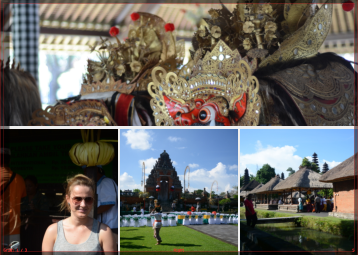
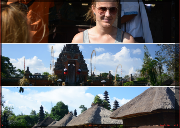

# Photobook

Simple program to generate photo books out of photos specified by a simple YAML
file.

The program takes care of properly cutting, resizing the images. It offers
different templates for photo pages. Each template is a
[Twig](http://twig.sensiolabs.org/) SVG file. All pages will be concatenated
and converted into a single PDF.

## Installation

Requires:

* PHP >= 7
* [Inkscape](https://inkscape.org/) for sane SVG to PDF conversion
* [pdftk](https://www.pdflabs.com/tools/pdftk-the-pdf-toolkit/) for PDF concatenation

To install all required PHP libraries, run:

    composer install

## Usage

The program (only) has a CLI interface:

    ./bin/create <yamlFile>

# Documentation

You can find a full working example book definition in `example.yml` – just the
referenced pictures are missing. The development output of the example can be
found under [`docs/example.pdf`](docs/example.pdf).

## The Book

You must provide a basic defintion of the book format:

    book:
        title: "My Book Title"
        baseDir: "/path/to/folder"
        format:
            width: 303
            height: 216
            cutOff: 3
        production: false 

The book title is not used for anything yet. The baseDir is the directory where
your pictures are located. This allows you to use relative paths for all
picture references in the pages below.

The `format` block specifies the size of the book in *millimeters*. When
printing it is likely that the printer will cut off some border. The size of
the cut off is specified by the `cutOff` property. The width and height is
pecified *including* the cutOff. In this example the resulting page size would
be 210 * 297 millimeters (DIN A4).

The `production` setting allows you to author the book quicly with reduced
picture sizes (90 dpi) and debug information embedded in the generated PDF.
When `production` is set to `true` no debug information is shown and the
picture resolution is set to *300 dpi*.

There are some more options (font sizes, fonts, …) which you can look up in the
classes `Kore\Book` and `Kore\Book\Format`.

## The Page Types

After describing the basic configuration of the book there are only pages left
to specify. This is one large array, like:

    pages:
        - type: "caption"
          caption: "Tempel des schwimmenden Gartens"
          photo: 2016-07-14_08-44-30_DSC_8052.JPG
          position: .2
        - 2016-07-14_09-15-53_DSC_8085.JPG

There are different page types referencing different templates:

### Plain Photo

The plain photo:

    - 2016-07-14_09-15-53_DSC_8085.JPG

Just pass a file name and the image will be shown full page.

### Photo With Caption

Specifying a photo with caption:

    - type: "caption"
      caption: "Tempel des schwimmenden Gartens"
      photo: 2016-07-14_08-44-30_DSC_8052.JPG
      position: .2

Must define `type: caption` and con contain a `photo` with a file path pointing
to the photo. The `position` defines the vertical placement of the `caption`.

### Stacked Photos

Stacked photos show two photos on a white background with an optional photo
caption:

    - type: "stacked"
      photos:
        - 2016-07-14_07-16-34_DSC_8032.JPG
        - 2016-07-14_07-17-10_DSC_8034.JPG
      texts:
        - Optional caption for first photo
        - Optional caption for second photo

The `texts` parts is optional if you want to leave the photos without caption.

### Spread Photos on Background

Spread a variable number of photos across a blurred photo background:

    - type: "spread"
      background: 2016-07-14_09-03-20_DSC_8066.JPG
      photos: # 2 - 4 photos
        - 2016-07-14_08-45-11_DSC_8053.JPG
        - 2016-07-14_08-52-50_DSC_8057.JPG
        - 2016-07-14_08-58-26_DSC_8062.JPG
        - 2016-07-14_09-03-03_DSC_8065.JPG

The `background` photo will be blurred and the photos from the `photos` list
will be distributed across the background in a regular fashion. You may specify
up to four photos.

### Clear Double Page

Used to ensure a chapter starts on the right page:

    - type: "cleardoublepage"

Insert a white (empty) page to ensure the following page is on the right page
in the book. Common to use before any page which indicates a chapter start
(like the following `travel` type).

### Travel Page

Most complex page I use to indicate we travelled from one location to another.
Very custom and specific layout:

    - type: "travel"
      from: "Witten"
      # http://www.fileformat.info/info/unicode/block/transport_and_map_symbols/list.htm
      symbols: ['🚗', '🚌', '🛧', '🛧', '🚌']
      to: "Sanur (Bali)"
      date: "2016-07-14"
      photo: "2016-07-14_02-39-29_IMG_20160714_085029.jpg"
      image: travel_witten_bali.svg

Required options are `from`, `to` and `photo` – everything else is optional.

All texts from the `symbols` array will be displayed between the `from` and
`to` headlines. The optional `date` will be displayed below the headlines.

The `photo` will be blurred and used as a background of the page.

The optional `image` will be shown on the lower half of the page and may be be,
for example, a map showing which route you travelled.

